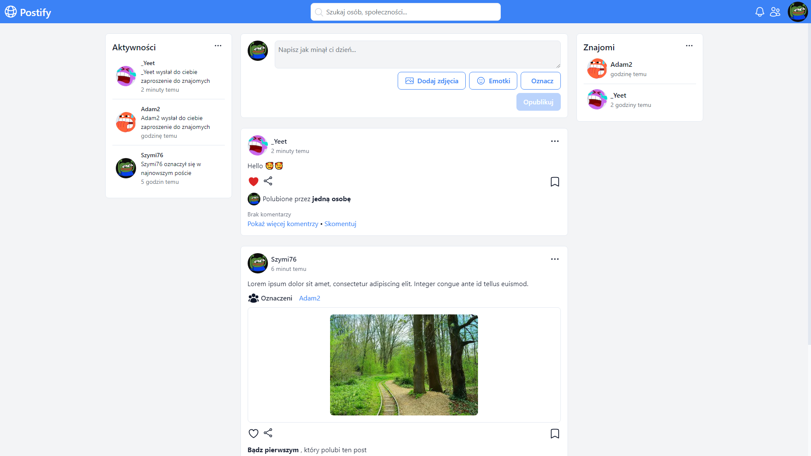

  

  <h3 align="center">Postify</h3>
  

    Aplikacja social media do publikowania postów.
  

## O projekcie

[

Aplikacja umożliwia:
* Publikowanie postów
* Likowanie, zaznaczanie i komentowanie postów
* Zarządzanie profilem, itd.

### Zbudowana za pomocą

Lista frameworków i bibliotek, którymi została zbudowana aplikacja.

* 
* 
* 
* 
* 
* 
* 
* 
